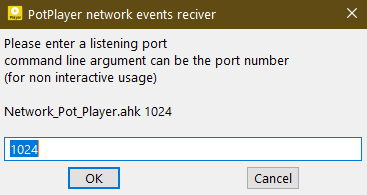
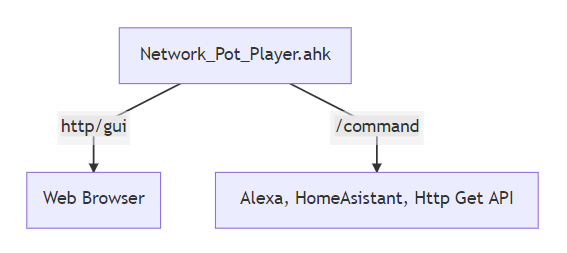

# NetLIRC Remote Control Script

# NetLIRC PotPlayer

Made by Neumann Gregor

This is a AHK [https://www.autohotkey.com](https://www.autohotkey.com) script that offers a remote control on your mobile devices, or anything that has a web browser. It uses HTML5, CSS3, JavaScript and AJAX along the AHK, still you only need to have AHK installed only.

This script offers remote control over HTTP Get calls (curl, Alexa, HomeAssistant, and more) and a full fledged WEB GUI. The GUI has feedback, buttons blink black if command execution confirmed by backend or red if error, it has a upper part message area that appears only when needed. The interface keeps the screen on for as long as the tab in with the GUI is in foreground.

####Used libraries

• **AutoHotKey (AHK)**

   [AHKhttp](AHKhttp.ahk), I use a modified version that fixes a memory leak called [AHKhttp_MemoryLeakFix](AHKhttp_MemoryLeakFix.ahk)
    
   [AHKsock](AHKsock.ahk)
    
• **CSS**

   [Bootstrap v4.1.0](bootstrap.min.css)
    
    [Font Awesome fontello selection](font-awesome.min-fontello-embedded.css)
    
• **JavaScript**

   [NoSleep](NoSleep.min.js)

## How to install

• Install AutoHotKey https://www.autohotkey.com
• Run the script in one of the two modes

interactive mode:


 command line mode:
Specify the port number as a command line argument
```bash
Network_Pot_Player.ahk 1024
```


## Usage

• Edit the [Network_Pot_Player.ahk](Network_Pot_Player.ahk)

Specify the path to PotPlayer executable, it is needed for the custom icon in the tray

```autohotkey
; Set icon of script in tray same as PotPlayer
; Set FileName to target the PotPlayerExecutable
; 64-bit -> C:\Program Files\DAUM\PotPlayer\PotPlayerMini64.exe
; 32-bit -> C:\Program Files (x86)\DAUM\PotPlayer\PotPlayerMini.exe
FileName := "C:\Program Files\DAUM\PotPlayer\PotPlayerMini64.exe" 
```

Function diagram:



## How to modify to use it with another application

The modification need to be made in 2 places, the AHK script and the HTML page that is the GUI.

1. Open [Network_Pot_Player.ahk](Network_Pot_Player.ahk)

Scroll to the following code in it:

```autohotkey
;Insert new network events here, each event /test has a function assoicated that needs to be written
;Folowing the patern of the other ones

;;##########################################################
;Custom Network Events List
paths["/ok"] := Func("OK")
```

Now lets assume we want to add a event called *MyCommand*
we add this line after:

```autohotkey
paths["/mycommand"] := Func("MyCommand")
```

Then we scroll down to the following code in it:

```autohotkey
;##########################################################
;Custom Network Events Functions
OK(ByRef req, ByRef res) {
	IfWinExist, PotPlayer
	{
		WinActivate, PotPlayer
		WinGetPos, X, Y, Width, Height, PotPlayer
		Send {space}
		guidisp("Play Pause",X, Y)
		res.SetBodyText("done")
	}
	else
	{
	guidisp("PotPlayer NOT running",0, 0)
	res.SetBodyText("PotPlayer NOT running")
	}
    res.status := 200
}
```

After that we add our own function:

```autohotkey
MyCommand(ByRef req, ByRef res) {
	IfWinExist, PotPlayer
	{
		WinActivate, MyApplicationWindowTitle
		WinGetPos, X, Y, Width, Height, MyApplicationWindowTitle
		Send {space}
		guidisp("MyApplication recived space gui message",X, Y)
		res.SetBodyText("done")
	}
	else
	{
	guidisp("MyApplication NOT running",0, 0)
	res.SetBodyText("MyApplication NOT running")
	}
    res.status := 200
}
```
This code will activate the window with the title *MyApplicationWindowTitle* and will send it the a simulated space press then it will display the  *MyApplication received space gui message*, else if *MyApplication* is not running it displays the gui message *MyApplication NOT running* and sends the error message to the web gui *MyApplication NOT running*.

Do not change :

```autohotkey
res.status := 200
```

**200** is the standard response for successful HTTP requests.
**404** is page or resource not found, it is handled already in the script.

2. Open [HTML.html](HTML.html)

```html
<div class="container-fluid">
  <div class="row">
    <button type="button" class="btn btn-primary col p-2" id="id_1" onclick='(httpGet("/mute")== "done") ? highlight(id_1,"#000"):highlight(id_1,"#f00");'><i class="icon-volume-off"></i> Mute</button>
    <button type="button" class="btn btn-primary col p-2" id="id_2" onclick='(httpGet("/power")== "done") ? highlight(id_2,"#000"):highlight(id_2,"#f00");'><i class="icon-off"></i> Power</button>
  </div>
  <div class="row">
    <button type="button" class="btn btn-primary col p-2" id="id_3" onclick='(httpGet("/1")== "done") ? highlight(id_3,"#000"):highlight(id_3,"#f00");'><i class="icon-sun"></i> Brightness Reset</button>
    <button type="button" class="btn btn-primary col p-2" id="id_4" onclick='(httpGet("/2")== "done") ? highlight(id_4,"#000"):highlight(id_4,"#f00");'><i class="icon-sun"></i> <i class="icon-minus"></i> Brightness -1%</button>
    <button type="button" class="btn btn-primary col p-2" id="id_5" onclick='(httpGet("/3")== "done") ? highlight(id_5,"#000"):highlight(id_5,"#f00");'><i class="icon-sun"></i> <i class="icon-plus"></i> Brightness +1%</button>
  </div>
```

A button is defined by a line like this:

```html
<button type="button" class="btn btn-primary col p-2" id="id_mycommand" onclick='(httpGet("/mycommand")== "done") ? highlight(id_mycommand,"#000"):highlight(id_mycommand,"#f00");'><i class="icon-my-command"></i> My Command</button>
```

|html|what it does|
|:-:|--|
|btn-primary|is button collor from bootstrap|
|id="id_mycommand"|id_mycommand - is used to trigger the highlight|
|httpGet("/mycommand")|/mycommand - is the http get request that triggers the script|
|#000|black color in hex format for confirmed execution|
|#f00|red color in hex format for confirmed execution|
|`<i class="icon-my-command"></i>`|icon-my-command is a icon from font awesome, embedded with [http://fontello.com](http://fontello.com), exclude the **i** tag for no icon|
|</i> My Command</button>|the name of the button starts with a space between icon and text|

Now lets change color of our page and buttons, there are 3 places:

1. For background of page:

the *hex code*, see table bellow.

```html
<style type="text/css">
   body { background: #007bff !important; } /* Adding !important forces the browser to overwrite the default style applied by Bootstrap btn-primary = #007bff*/
</style>
```

2. For each button:

*btn-primary*, see table bellow.

```html
<button type="button" class="btn btn-primary col p-2" ...
```

3. For the screen on feature:

*btn-primary*, see table bellow.

```html
<!-- "Screnn on" feature based on NoSleep.js-->
<input type="button" id="toggle" class="btn btn-primary col" value="Screen on is disabled" style="font-size : 15px;"/>
```

[Colors of Bootstrap 4](Bootstrap4Colors.txt)

```html
// Colors
$blue:    #007bff !default; // primary
$indigo:  #6610f2 !default;
$purple:  #6f42c1 !default;
$pink:    #e83e8c !default;
$red:     #dc3545 !default; // danger
$orange:  #fd7e14 !default;
$yellow:  #ffc107 !default; // warning
$green:   #28a745 !default; // success
$teal:    #20c997 !default;
$cyan:    #17a2b8 !default; // info

// Grays
$white:    #fff !default;
$gray-100: #f8f9fa !default; // light
$gray-200: #e9ecef !default;
$gray-300: #dee2e6 !default;
$gray-400: #ced4da !default;
$gray-500: #adb5bd !default;
$gray-600: #868e96 !default; // secondary
$gray-700: #495057 !default;
$gray-800: #343a40 !default; // dark
$gray-900: #212529 !default;
$black:    #000 !default;
```

